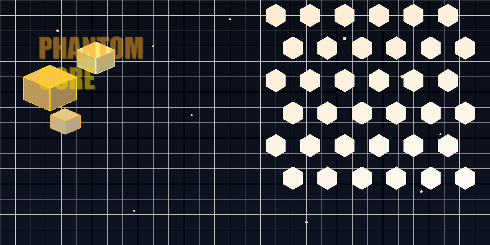

# PHANTOM CORE

### Decoupled WordPress SPA Framework — 555 Settings · 34 REST Routes · 31 Templates · Security 100/100

<div align="center">
  
</div>

---

Phantom Core is a **decoupled WordPress framework** that replaces the traditional PHP template hierarchy with a static HTML SPA architecture. There is no `wp-content/themes/` directory — the plugin IS the theme. Dynamic data is injected client-side via a custom REST API under `phantom/v1`, making the frontend **100% replaceable** without touching any PHP.

---

## ◆ System Overview

```
                    ┌──────────────────────────────────────┐
                    │           WordPress CMS               │
                    │  Users · Posts · Pages · Media · SEO  │
                    └──────────────┬───────────────────────-┘
                                   │
                    ┌──────────────▼───────────────────────-┐
                    │       Phantom Core Plugin             │
                    │                                       │
                    │  ┌────────────┐  ┌────────────────┐   │
                    │  │  Settings  │  │   REST API     │   │
                    │  │  Registry  │  │  phantom/v1    │   │
                    │  │  555 sets  │  │  34 routes     │   │
                    │  └─────┬──────┘  └───────┬────────┘   │
                    │        │                  │            │
                    │  ┌─────▼──────────────────▼────────┐   │
                    │  │     Shell SPA Router             │   │
                    │  │  template_redirect · 31 routes   │   │
                    │  │  SEO · 65 CSS vars · Security    │   │
                    │  └────────────────┬─────────────────┘   │
                    │                   │                     │
                    │  ┌────────────────▼─────────────────┐   │
                    │  │    Customizer · CSS Engine       │   │
                    │  │  14 panels · 49 sections         │   │
                    │  │  13 controls · 8 CSS modules     │   │
                    │  └──────────────────────────────────┘   │
                    └────────────────────────────────────────────────┘
                                                   │
                    ┌──────────────────────────────▼────────────────┐
                    │              Frontend SPA                     │
                    │                                                │
                    │  31 Static HTML Templates                      │
                    │  phantom-data.js (REST consumer)               │
                    │  Swup.js (SPA transitions)                     │
                    │  65 CSS custom properties                      │
                    └────────────────────────────────────────────────┘
```

---

## ◆ Stats

| Metric | Value |
|--------|-------|
| Version | **1.5.0** |
| Settings | **555** (44 sections) |
| REST Routes | **34** under `phantom/v1` |
| HTML Templates | **31** |
| Customizer | **14 panels**, **49 sections** |
| Custom Controls | **13** |
| CSS Modules | **8** (65 CSS vars) |
| PHP Files | **38** (12,506 lines) |
| Frontend JS | **24** files (7,815 lines) |
| PHPUnit Tests | **23** (4,206 assertions) |
| Backend Health | **98/100** |
| Security | **100/100** |
| WooCommerce | Full integration |

---

## ◆ Three Ways to Customize

| Method | Access | Best For |
|--------|--------|----------|
| **Customizer** | `/wp-admin/customize.php` | Visual live preview — colors, fonts, layout |
| **Admin Page** | `Appearance → Phantom Core` | Full CRUD — all 555 settings |
| **REST API** | `/wp-json/phantom/v1` | Programmatic — integrations, automation |

---

## ◆ Frontend Replacement

The frontend is **100% decoupled**. Replace it with any framework — React, Vue, Next.js, or static HTML — without touching PHP:

```
1. Keep [data-phantom] attributes     (content binding)
2. Keep CSS var references             (visual theming)
3. Keep `#swup` container              (SPA navigation)
4. Keep phantom-data.js                 (REST bridge)
5. Replace everything else freely
```

See [`theme-detail/FRONTEND-REPLACE-GUIDE.md`](theme-detail/FRONTEND-REPLACE-GUIDE.md) for complete instructions.

---

## ◆ Documentation

| File | Contents |
|------|----------|
| [`theme-detail/ARCHITECTURE.md`](theme-detail/ARCHITECTURE.md) | System architecture, data flow, init order |
| [`theme-detail/FEATURES.md`](theme-detail/FEATURES.md) | Complete 555-setting inventory, 31 template catalog |
| [`theme-detail/CUSTOMIZATION.md`](theme-detail/CUSTOMIZATION.md) | 3-way customization, CSS vars, data attributes |
| [`theme-detail/FRONTEND-GUIDE.md`](theme-detail/FRONTEND-GUIDE.md) | Data binding, WooCommerce, adding features |
| [`theme-detail/FRONTEND-REPLACE-GUIDE.md`](theme-detail/FRONTEND-REPLACE-GUIDE.md) | Step-by-step frontend replacement guide |
| [`theme-detail/FORENSIC-AUDIT.md`](theme-detail/FORENSIC-AUDIT.md) | Full audit report, 24 findings, health scores |

---

## ◆ Requirements

**WordPress** 6.4+ · **PHP** 8.1+ · **WooCommerce** 8.0+ (optional) · **MySQL** 8.0

```bash
# Push to Docker
docker cp phantom-core wordpress:/var/www/html/wp-content/plugins/phantom-core

# Pull from Docker
docker cp wordpress:/var/www/html/wp-content/plugins/phantom-core ./phantom-core
```

---

<p align="center">
  <sub>Phantom Core v1.5.0 · <a href="https://github.com/HAmmadsiamil007/PHANTOM-wordpress">github.com/HAmmadsiamil007/PHANTOM-wordpress</a></sub>
</p>
